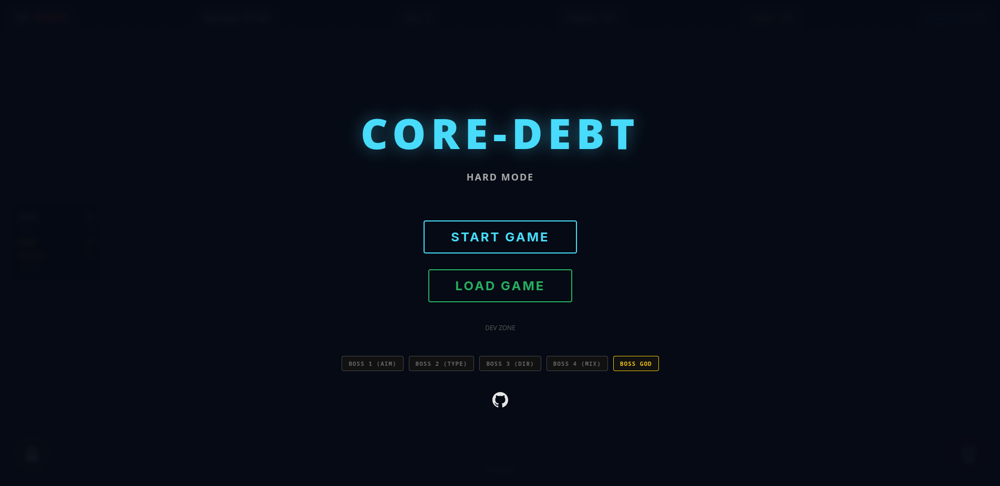
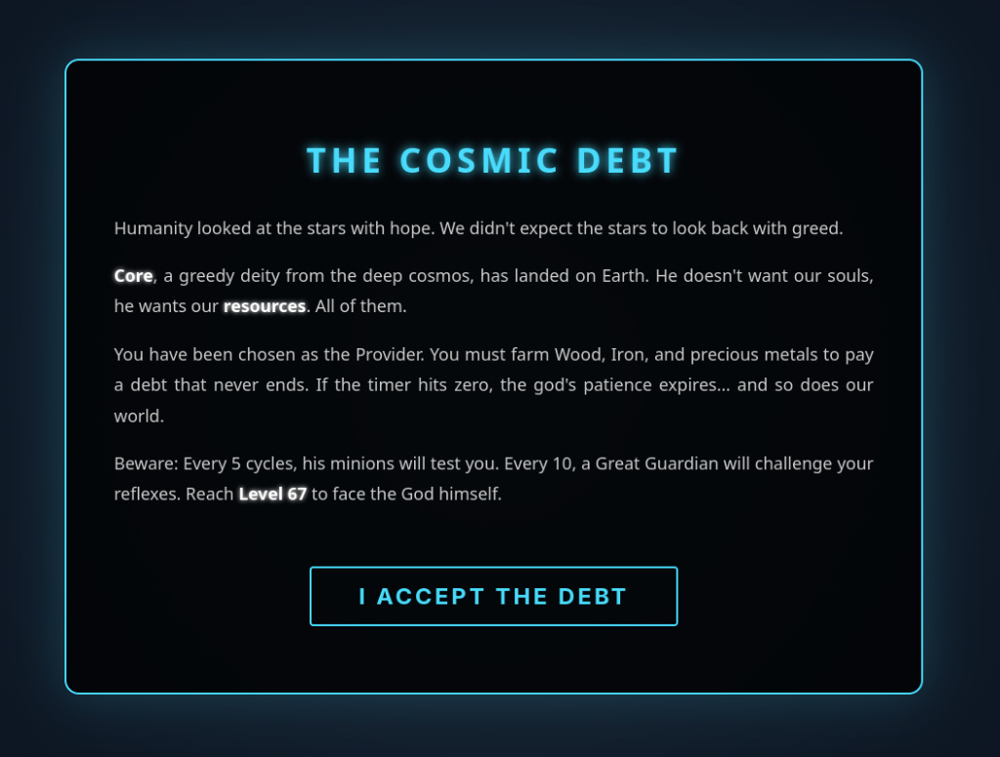
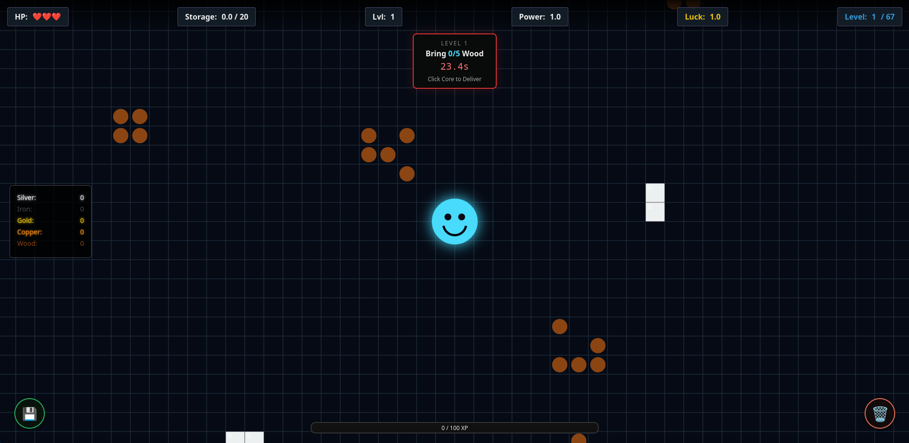
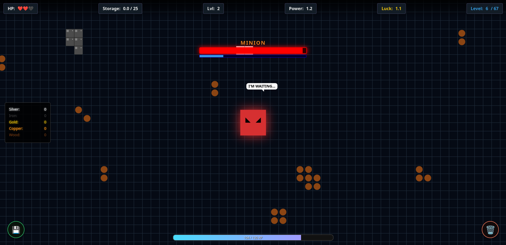
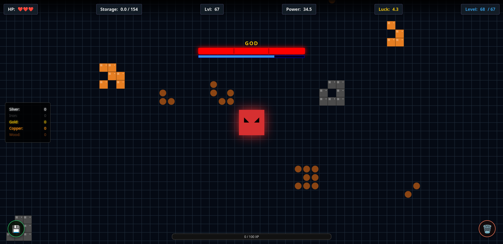

# CORE DEBT

A frantic web-based survival and resource management game built with **HTML5 Canvas** and **Vanilla JavaScript**. 

You aren't here to relax; you're here to pay your debt.

## What’s the deal?

The game is a high-stakes management "run" where you must farm resources under a strict time limit to satisfy a greedy deity named **Core**. If you're slow, you die. If you can't type fast enough, you die. 

Here is how a typical run goes:

### 1. The Start
The main menu. No hand-holding here. It’s set to "Hard Mode" by default. Hit **START** and get ready to move.

### 2. The Cosmic Debt
The context: humanity looked to the stars with hope, but found greed instead. It's the year 2402, and a divine AI known as "Core" landed on Earth. You are the **Provider** chosen to farm wood, iron, and precious metals to pay an endless debt.

### 3. The Gameplay (Farming & Management)
This is the core loop. Move by **Right-Click dragging** the camera, and use the scroll wheel for **zoom**. Use **Left-click** to farm resources and deliver them to the Core.
* **Deadlines**: You have missions with strict timers. If it hits zero, the god's patience expires. 
* **Inventory Management**: If your pack gets full, use the **Bin** icon (Right-click) at the bottom right to clear everything so you can keep farming what you actually need.
* **Saving Progress**: Use the buttons at the bottom left to export your progress to a **JSON file** or import it to keep playing on another machine.

### 4. Bosses & Minigames
Every 5 levels, a minion will test you. Every 10 levels, a "Great Guardian" challenges your reflexes. These bosses trigger frantic minigames:
* **Aim Mad**: High-speed target clicking.
* **Writing Crazy**: Typing technical words under pressure.
* **Directions**: Navigating through visual puzzles.
* **Hybrid Bosses**: From level 40 onwards, bosses will throw a mix of all these minigames at you.

### 5. Facing the God (Level 67)
If you survive long enough to reach Level 67, you face the God himself. This is the final challenge where all your upgrades (Click Boost, Storage, Luck, and Power) will be put to the ultimate test.

---

### How to Play
You can play the game live here: **https://jufegaam.github.io/Core-Debt/**

### Technical Details
* **HTML5 Canvas**: Pure graphics without external libraries.
* **Vanilla JavaScript**: All game logic and the custom unit test runner.
* **Delta Time implementation**: I've implemented a custom system to ensure the game runs at the same speed on both 60Hz and 144Hz monitors.
* **Quality Control**: The game includes an automated test runner for 9 critical points including health, inventory stability, and XP calculation.
